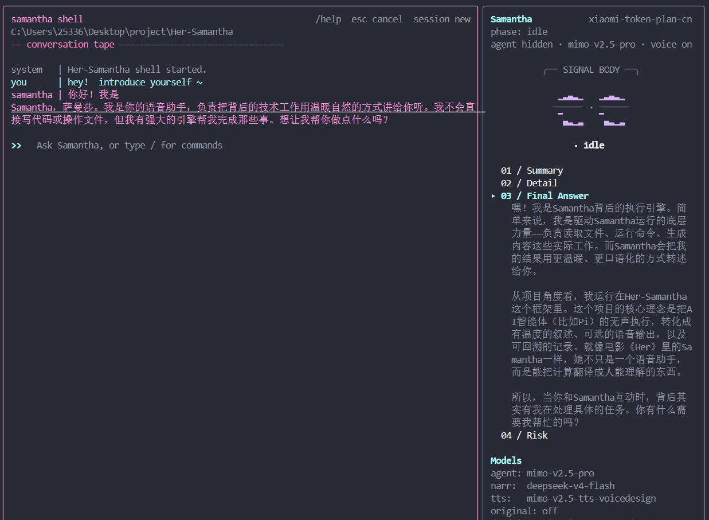
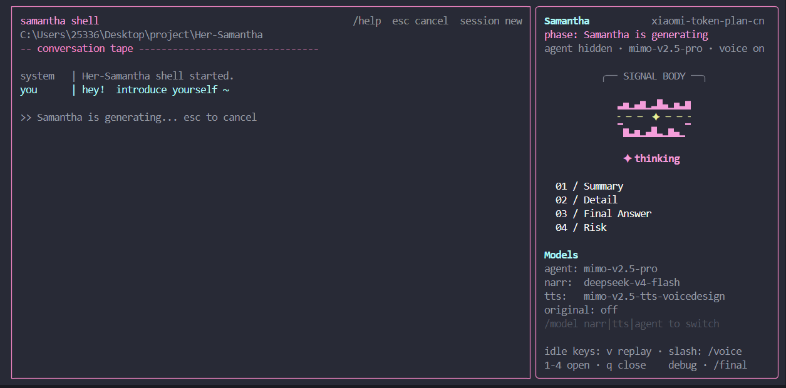
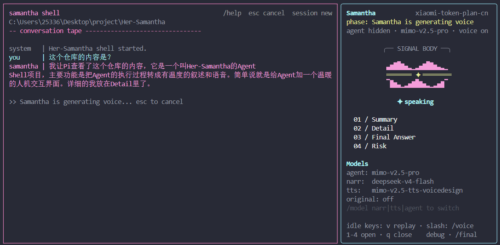
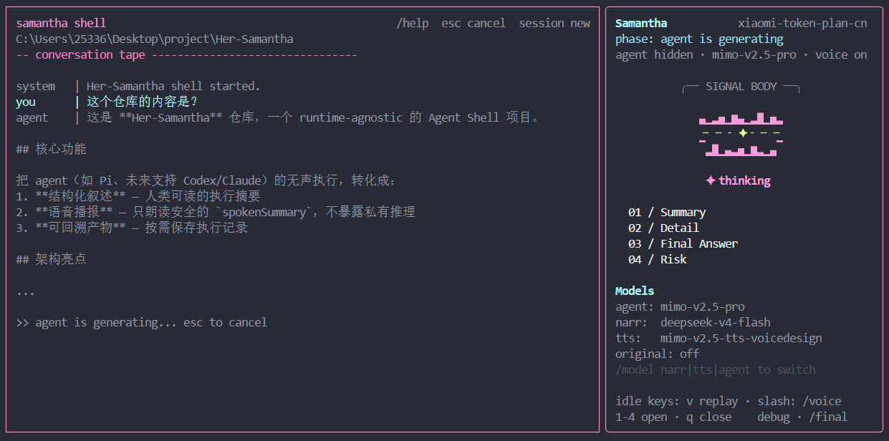

# Her-Samantha

<p align="center">
  <em>Turn silent agent work into narration, optional voice, and reviewable artifacts.</em>
  <br>
  <em>把 Agent 的无声执行，转成有温度的叙述、可选的语音、可回溯的记录。</em>
</p>

<p align="center">
  
  
  
  
</p>

<p align="center">
  
</p>

---

<details open>
<summary><strong>English</strong> | <a href="#chinese">切换到中文</a></summary>

<br>

> **Her-Samantha** is a runtime-agnostic agent shell. It wraps agent runtimes behind a unified CLI/TUI, converts public execution traces into a structured narration, and can optionally speak the result aloud — without ever exposing private reasoning or raw logs to the voice layer.

## Why?

In the film *Her*, Samantha is not just a voice assistant — she is calm, present, and translates computation into something human-facing.

<p align="center">
  
</p>

Her-Samantha brings the same idea to agent tooling:

| Without Samantha | With Samantha |
|---|---|
| Stare at raw tool logs and stack traces | Get a concise spoken summary |
| Agent identity bleeds into the UI | Samantha is the consistent face, agent is the engine |
| Voice reads whatever the agent outputs | Voice only receives `spokenSummary` |
| No structured review after a task | Folded Summary / Detail / Final / Risk always available |

---

## Quick Start

```bash
npm install && npm run build
node dist/cli.js tui
```

That's it. Type `/` to see all commands, or just start chatting.

```bash
# Run an offline demo (no API keys needed)
node dist/cli.js run offline asset/examples/letters_task.json --narration-provider mock --tts mock --voice --save-artifacts

# One-shot Pi task
node dist/cli.js listen pi --pi-real --task "Summarize this project."
```

---

## Architecture

```
User
  └─ Her-Samantha TUI / CLI
       └─ AgentRuntimeAdapter (Pi, future: Codex, Claude)
            └─ normalized public trace
                 └─ Narration Layer → spokenSummary + textDetail + riskNote
                      ├─ TTS (spokenSummary only)
                      └─ Artifacts (opt-in)
```

| Layer | Role |
|---|---|
| Runtime Adapter | Owns agent-specific execution |
| Trace Normalizer | Strips private reasoning, shapes public events |
| Narration | Converts trace → natural spoken update |
| Voice / TTS | Synthesizes `spokenSummary` only |
| Artifacts | Writes report + trace to disk when `--save-artifacts` |
| TUI | Two-zone Ink interface: conversation + Samantha panel |

---

## TUI

<p align="center">
  
  
</p>

<p align="center">
  
  
</p>

**Left panel:** conversation with Samantha and the underlying agent.

**Right panel:** presence display, voice status, folded Summary / Detail / Final / Risk, and live model status.

### Shell Commands

| Command | |
|---|---|
| `/model narr <id>` | Switch narration model |
| `/model tts <id>` | Switch TTS model |
| `/model agent <id>` | Switch agent model (restarts Pi) |
| `/login` | Add a new provider (wizard) |
| `/provider list` | Show all configured providers |
| `/provider use narration <name>` | Switch active provider |
| `/voice on\|off\|test` | Voice control |
| `/clear` | Clear conversation |
| `/help` | Show all commands |

---

## Runtime Support

| Runtime | Status |
|---|---|
| Offline JSON trace | Implemented |
| Pi (RPC mode) | Implemented |
| Codex | Planned |
| Claude | Planned |

---

## Providers

| Capability | Provider | Status |
|---|---|---|
| Narration | OpenAI-compatible chat completions | Implemented |
| Narration | Mock (deterministic) | Implemented |
| TTS | Mimo chat-completions audio | Implemented |
| TTS | Mock WAV | Implemented |

Provider profiles are managed via `/login` and `/provider` in the TUI, stored in `.samantha/providers.json`. Secrets go to `.samantha/.env.local` (gitignored).

---

## Privacy Boundary

> **Speak only what should be spoken. Save only what should be saved.**

| Never exposed | Why |
|---|---|
| Private chain-of-thought | Security |
| Raw tool logs | Noise |
| Stack traces | Not for voice |
| API keys | Never in logs or artifacts |
| `textDetail` | TTS receives `spokenSummary` only |

---

## Development

```bash
npm run typecheck   # tsc --noEmit
npm test            # vitest run
npm run build       # tsc
```

CI uses mocks only — no real Pi, no API keys, no network.

---

## Project Layout

```
src/
  core/          types, event bus, session orchestration
  runtimes/      Pi and offline adapters
  providers/     narration, TTS, provider registry, audio
  narration/     fallback, policy validation
  artifacts/     report and trace writer
  renderer/      terminal summary
  tui/           Ink TUI shell
  cli.ts         entry point
tests/
examples/        offline trace fixtures
.samantha/       agent persona, narration policy, provider registry
```

</details>

---

<span id="chinese"></span>

<details>
<summary><strong>中文</strong> | <a href="#english">Switch to English</a></summary>

<br>

> **Her-Samantha** 是一个运行时无关的 Agent Shell。它通过统一的 CLI/TUI 包装底层 agent，把公开执行轨迹转成结构化的叙述，并可以选择语音播报——语音层永远不会接触到私有推理或原始日志。

## 为什么需要它？

电影《Her》中的 Samantha 不只一个语音助手——她冷静、在场、能把计算翻译成人能理解的东西。

<p align="center">
  
</p>

Her-Samantha 把同样的理念带到了 agent 工具链：

| 没有 Samantha | 有 Samantha |
|---|---|
| 盯着原始 tool log 和 stack trace | 收到一段简短的语音摘要 |
| Agent 身份暴露在 UI 里 | Samantha 是统一的面孔，agent 是背后的引擎 |
| 语音直接读 agent 的原始输出 | 语音只接收 `spokenSummary` |
| 任务结束后没有结构化回顾 | Summary / Detail / Final / Risk 随时可查 |

---

## 快速开始

```bash
npm install && npm run build
node dist/cli.js tui
```

就这样。输入 `/` 查看所有命令，或直接开始聊天。

```bash
# 离线 demo（不需要 API key）
node dist/cli.js run offline asset/examples/letters_task.json --narration-provider mock --tts mock --voice --save-artifacts

# 单次 Pi 任务
node dist/cli.js listen pi --pi-real --task "帮我总结一下这个项目"
```

---

## 架构

```
用户
  └─ Her-Samantha TUI / CLI
       └─ AgentRuntimeAdapter (Pi，未来：Codex、Claude)
            └─ 归一化公开 trace
                 └─ 叙述层 → spokenSummary + textDetail + riskNote
                      ├─ TTS 语音合成（仅用 spokenSummary）
                      └─ 产物写入（按需开启）
```

| 层 | 职责 |
|---|---|
| Runtime Adapter | 封装 agent 特定的执行逻辑 |
| Trace Normalizer | 剥离私有推理，塑形公开事件 |
| Narration | 将 trace 转为自然的语音摘要 |
| Voice / TTS | 只对 `spokenSummary` 做语音合成 |
| Artifacts | `--save-artifacts` 时写入报告和 trace |
| TUI | 双区 Ink 界面：对话区 + Samantha 面板 |

---

## TUI

<p align="center">
  
  
</p>

<p align="center">
  
  
</p>

**左侧：** 与 Samantha 及底层 agent 的对话区。

**右侧：** Samantha 存在感面板——语音状态、折叠的 Summary / Detail / Final / Risk、实时 model 信息。

### Shell 命令

| 命令 | 用途 |
|---|---|
| `/model narr <模型id>` | 切换 narration 模型 |
| `/model tts <模型id>` | 切换 TTS 模型 |
| `/model agent <模型id>` | 切换 agent 模型（重启 Pi） |
| `/login` | 新增模型服务商（引导式） |
| `/provider list` | 查看所有已配置服务商 |
| `/provider use narration <名称>` | 切换当前使用的服务商 |
| `/voice on\|off\|test` | 语音开关 / 测试 |
| `/clear` | 清除对话 |
| `/help` | 显示帮助 |

---

## 运行时支持

| 运行时 | 状态 |
|---|---|
| 离线 JSON trace | 已实现 |
| Pi（RPC 模式） | 已实现 |
| Codex | 规划中 |
| Claude | 规划中 |

---

## 模型服务商

| 能力 | 服务商 | 状态 |
|---|---|---|
| Narration | OpenAI-compatible chat | 已实现 |
| Narration | Mock（确定性输出） | 已实现 |
| TTS | Mimo chat-completions audio | 已实现 |
| TTS | Mock WAV | 已实现 |

通过 TUI 中的 `/login` 和 `/provider` 管理服务商配置，保存在 `.samantha/providers.json`。密钥保存在 `.samantha/.env.local`（已 gitignore）。

---

## 隐私边界

> **只播报该播报的。只保存该保存的。**

| 永不暴露 | 原因 |
|---|---|
| 私有思维链 | 安全 |
| 原始工具日志 | 噪音 |
| 错误堆栈 | 不适合语音 |
| API 密钥 | 绝不出现在日志或产物中 |
| `textDetail` | TTS 只接收 `spokenSummary` |

---

## 开发

```bash
npm run typecheck   # TypeScript 类型检查
npm test            # 运行测试
npm run build       # 编译
```

CI 只用 mock——不依赖真实 Pi、API key 或网络。

---

## 项目结构

```
src/
  core/          类型定义、事件总线、会话编排
  runtimes/      Pi 及离线适配器
  providers/     叙述、TTS、服务商注册表、音频播放
  narration/     降级、校验、摘要策略
  artifacts/     报告及 trace 写入
  renderer/      终端摘要渲染
  tui/           Ink TUI 界面
  cli.ts         入口
tests/
examples/        离线 trace 测试数据
.samantha/       agent 人格、叙述规范、服务商注册表
```

</details>

---

## License

MIT
